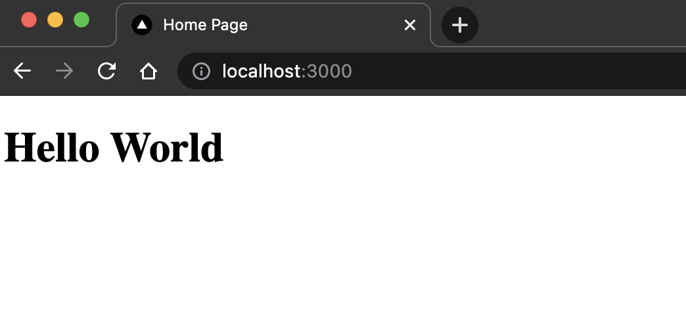
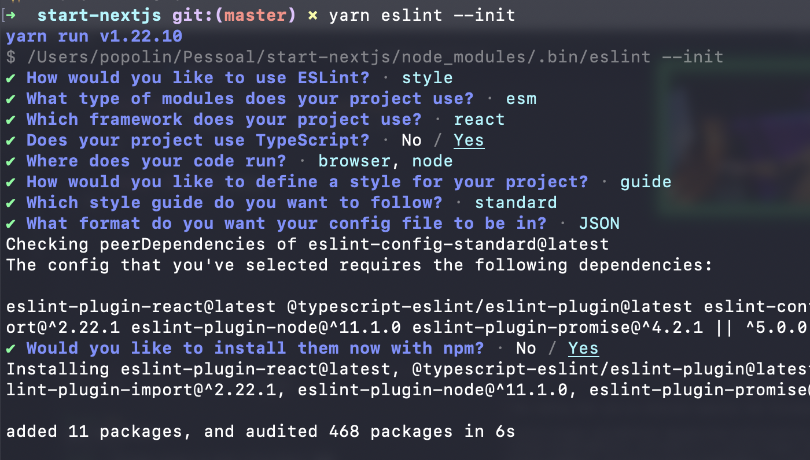
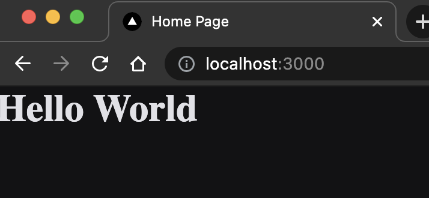
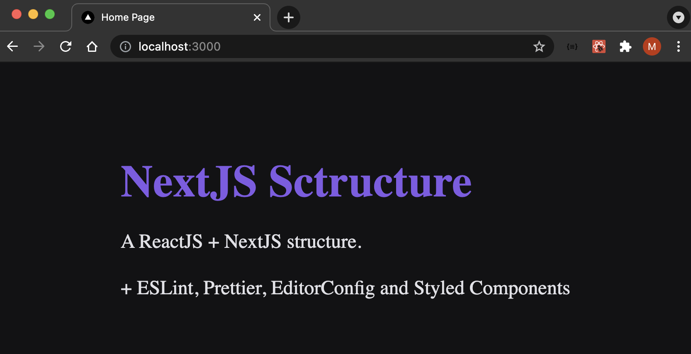

This is a [Next.js](https://nextjs.org/) project created with [`create-next-app`](https://github.com/vercel/next.js/tree/canary/packages/create-next-app).


<details>
  <summary>Getting Started</summary>

  First, run the create command:
  ```bash
  yarn create next-app start-nextjs
  ```

  Then go to the app directory and start coding:
  ```bash
  cd start-nextjs
  code .
  ```

  Now you should fix the README.md and delete the following files:
  * /styles
  * /public/*
  * /api

  > **/API** is exclusive to the servless api. Let's create it later

  Now it's time to add the Typescript:
  ```bash
  yarn add typescript @types/react @types/node -D
  ```

  Rename the js files to tsx:
  * `_app.js` => `_app.tsx`
  * `index.js` => `index.tsx`

  > In NextJS we don't need the routes. Every file that doesn't start with `_*` is considered a page that we can access via URL. So `index.tsx` would be the root URL: localhost:3000/

  Now let's clear the contents of the `index.tsx`:
  ```javascript
  import Head from 'next/head'

  export default function Home() {
    return (
      <div>
        <Head>
          <title>Home Page</title>
        </Head>
        <main>
          <h1>Hello World</h1>
        </main>
      </div>
    )
  }
  ```

  Remove the css from `_app_.tsx`:
  ```javascript
  function MyApp({ Component, pageProps }) {
    return <Component {...pageProps} />
  }

  export default MyApp
  ```

  Let's start the app:

  ```bash
  yarn dev
  ```

  > That will create the `.tsconfig.json` and `next-env.d.ts` with next types.

  Open [http://localhost:3000](http://localhost:3000) with your browser to see the first page:
  

</details>

<details>
  <summary>ESLint + Prettier</summary>
  <br>

  Install and start the ESLint:
  ```bash
  yarn add eslint -D
  yarn eslint --init
  ```

  ESLint options:
  * To check syntax, find problems, and enforce code style
  * JavaScript modules (import/export)
  * React
  * Yes (use Typescript)
  * ✔ Browser & ✔ Node (both)
  * Use a popular style guide
  * Standard
  * JSON
  * Yes
  <br>
  Result:
  

  Now just delete de `package-lock.json` and run yarn to update the dependencies:
  ```bash
  yarn
  ```

  Install the **prettier**:
  ```bash
  yarn add prettier eslint-plugin-prettier eslint-config-prettier -D
  ```

  And fix `.eslintsrc.json`:
  ```json
  {
    "env": {
        "browser": true,
        "es2021": true,
        "node": true
    },
    "extends": [
        "plugin:react/recommended",
        "standard",
        "plugin:@typescript-eslint/recommended",
        "prettier/@typescript-eslint",
        "prettier/standard",
        "prettier/react"
    ],
    "parser": "@typescript-eslint/parser",
    "parserOptions": {
        "ecmaFeatures": {
            "jsx": true
        },
        "ecmaVersion": 12,
        "sourceType": "module"
    },
    "plugins": [
        "react",
        "@typescript-eslint",
        "prettier"
    ],
    "rules": {
        "prettier/prettier": "error",
        "space-before-function-paren": "off",
        "react/prop-types": "off"
    }
}
```
  Create the `.eslintignore` to ignore files from eslint validation:
  ```
  node_modules
  .next
  /*.js
  ```
  Create the `prettier.config.js` to remove conflicts between eslint and prettier:
  ```
  module.exports = {
    semi: false,
    singleQuote: true,
    arrowParams: 'avoid',
    trailingComma: 'none',
    endOfLine: 'auto'
  }
  ```

  Add the following line
  ```
    import React from 'react'
  ```
on the top of `.tsx` files. ESlint requires that.

Convert Home to a React.FC const:
```
const Home: React.FC = () => {
  ...
}
```

Convert MyApp to React.FC const:
```
import {AppProps} from 'next/app'

const MyApp: React.FC<AppProps> = ({ Component, pageProps }) => {
    ...
}
```

  Start the app:
  ```bash
  yarn dev
  ```

</details>


<details>
  <summary>Editor Config and Styled Components</summary>
  Create the Editor Config file `.editorconfig`:
```
root = true

[*]
indent_style = space
indent_size = 2
charset = utf-8
end_of_line = lf
trim_trailing_whitespace = true
insert_final_newline = true
```

## Styled Components
[Add Styled Components to NextJS:]([https://link](https://github.com/vercel/next.js/tree/canary/examples/with-styled-components))

Install Styled Components:
```bash
  yarn add styled-components
  yarn add @types/styled-components -D
```

Create the file `babel.config.js`:
```javascript
module.exports = {
  presets: ["next/babel"],
  plugins: [["styled-components", { "ssr": true }]]
}
```

Create the `_document.tsx` file:
```javascript
import React from 'react'
import Document, { DocumentContext, DocumentInitialProps } from 'next/document'
import { ServerStyleSheet } from 'styled-components'

export default class MyDocument extends Document {
  static async getInitialProps(ctx: DocumentContext): Promise<DocumentInitialProps> {
    const sheet = new ServerStyleSheet()
    const originalRenderPage = ctx.renderPage

    try {
      ctx.renderPage = () =>
        originalRenderPage({
          enhanceApp: (App) => (props) =>
            sheet.collectStyles(<App {...props} />),
        })

      const initialProps = await Document.getInitialProps(ctx)
      return {
        ...initialProps,
        styles: (
          <>
            {initialProps.styles}
            {sheet.getStyleElement()}
          </>
        ),
      }
    } finally {
      sheet.seal()
    }
  }
}
```

Now let's add the global styles. First, create the `/src` folder and move `/pages` to there.
<br>
Create the file `/styles/global.ts` inside `/src`:
```css
import { createGlobalStyle } from "styled-components";

export default createGlobalStyle`
  * {
    margin: 0;
    padding: 0;
    box-sizing: border-box;
  }
  body {
    background: #121214;
    color: #e1e1e6;
  }
`
```

And add the global styles do MyApp:
```javascript
  import React from 'react'
import {AppProps} from 'next/app'
import GlobalStyle from '../styles/global';

const MyApp: React.FC<AppProps> = ({ Component, pageProps }) => {
  return (
    <>
      <Component {...pageProps} />
      <GlobalStyle />
    </>
  )
}
export default MyApp
```

Result:

</details>


<details>
  <summary>Add Themes</summary>
Create the `/styles/theme.ts` file:
```javascript
const theme = {
  colors: {
    background: '#121214',
    color: '#e1e1e6',
    primary: '#8257e6'
  }
}
export default theme
```

Add the theme to the app:
```javascript
import React from 'react'
import {AppProps} from 'next/app'
import { ThemeProvider } from 'styled-components';

import GlobalStyle from '../styles/global';
import theme from '../styles/theme';

const MyApp: React.FC<AppProps> = ({ Component, pageProps }) => {
  return (
    <ThemeProvider theme={theme}>
      <Component {...pageProps} />
      <GlobalStyle />
    </ThemeProvider>
  )
}
export default MyApp
```

And now, let's fix the `global.ts` file. First, create the `/styles/styled.d.ts` file:
```javascript
import 'styled-componets'
import theme from '../styles/theme'

export type Theme = typeof theme

declare module 'styled-components' {
  export interface DefaultTheme extends Theme {}
}
```

Now the `styled.d.ts` allows us to intelisense the `global.ts` with our theme params:
```javascript
  body {
    background: ${props => props.theme.colors.background};
    color: ${props => props.theme.colors.color;
  }
```

To finish, let's create a local style file, `style/pages/Home.ts`:
```css
import styled from 'styled-components'

export const Container = styled.div`
  width: 100vw;
  height: 100vh;
  display: flex;
  justify-content: center;
  align-items: center;
  flex-direction: column;
  h1 {
    font-size: 54px;
    color: ${props => props.theme.colors.primary};
    margin-top: 40px;
  }
  p {
    margin-top: 24px;
    font-size: 24px;
    line-height: 32px;
  }
`
```

And fix the /pages/index.tsx to use the styles:
```javascript
import React from 'react'
import Head from 'next/head'
import { Container } from '../styles/pages/Home';

const Home: React.FC = () => {
  return (
    <Container>
      <Head>
        <title>Home Page</title>
      </Head>
      <main>
        <h1>NextJS Sctructure</h1>
        <p>A ReactJS + NextJS structure.</p>
        <p>+ ESLint, Prettier, EditorConfig and Styled Components</p>
      </main>
    </Container>
  )
}
export default Home;
```
Result:

</details>

